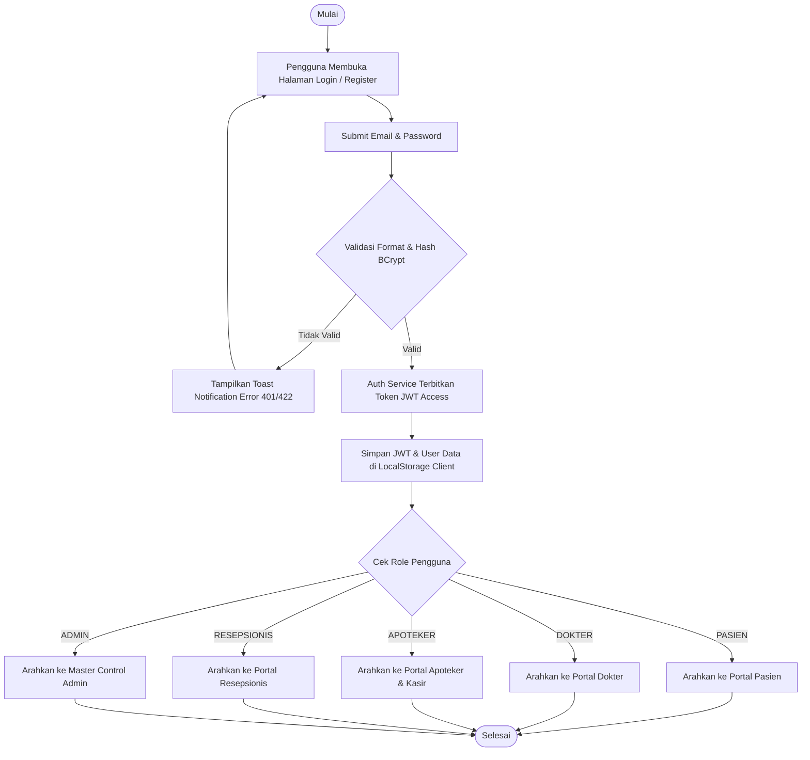
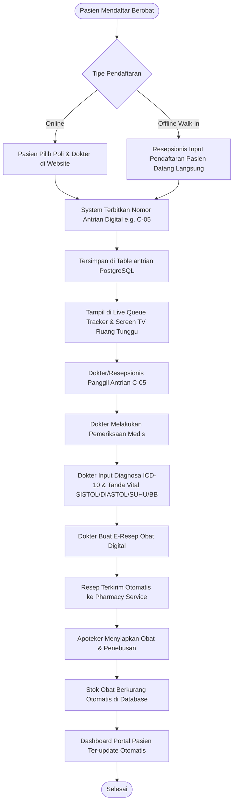
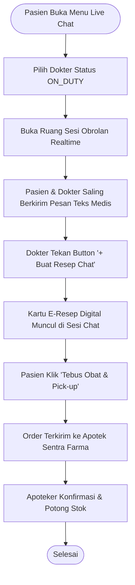
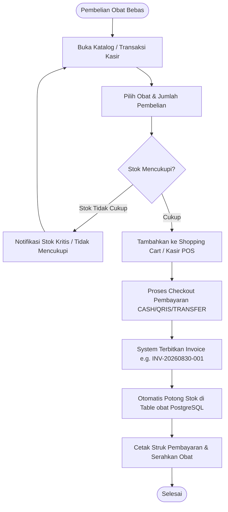

# Dokumentasi Perancangan Sistem: Sentra Farma

## 1. Flowchart Otentikasi & Autorisasi Pengguna (JWT & RBAC)

---

## 2. Flowchart Alur Berobat Pasien & Antrian Klinik Digital

---

## 3. Flowchart Konsultasi Live Chat Dokter & Tebus Resep ("Halodoc Style")

---

## 4. Flowchart Penjualan Obat Bebas Kasir Apotek (POS & Catalogue)

